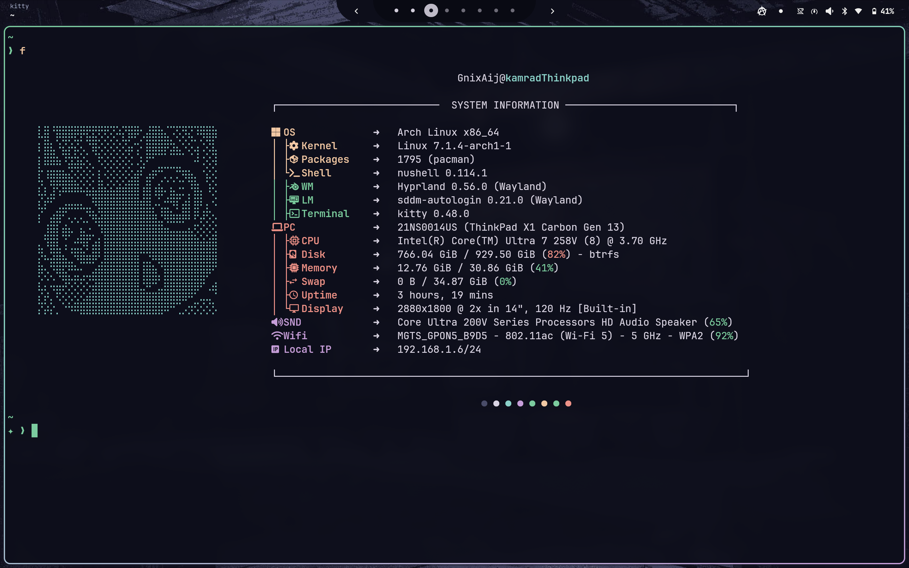
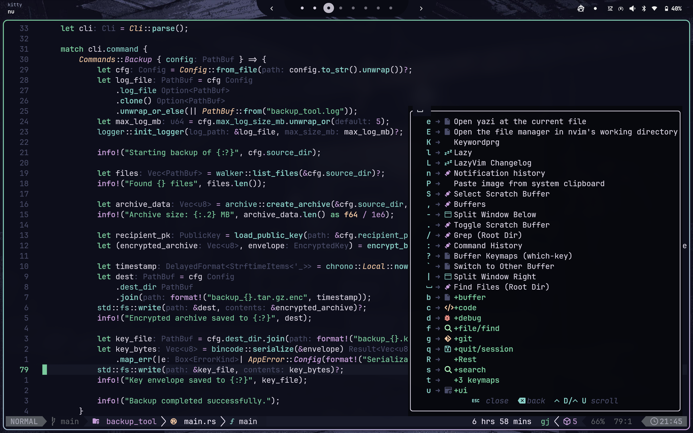
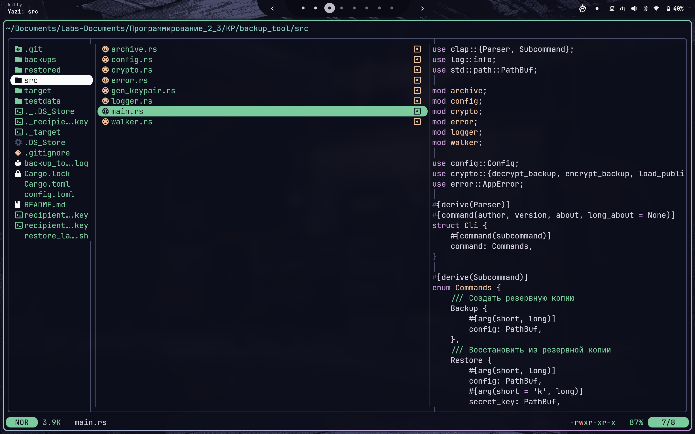

<h1 align="center">
  🌌 Omarchy Linux Dotfiles
  <br>
  
  
</h1>

<p align="center">
  <i>Мои элегантные и воспроизводимые конфигурационные файлы для Arch Linux (Omarchy), стилизованные в кастомной теме <b>pastel-hacker</b>.</i>
</p>

---

## 📸 Галерея (Screenshots)

> **Заметка:** Чтобы галерея отображалась корректно, сделай актуальные скриншоты в своей системе с темой `pastel-hacker` и сохрани их в папку `assets/` с именами, указанными ниже.

| Desktop (Hyprland + Waybar) | Terminal (Kitty + Nushell) |
| :---: | :---: |
|  |  |
| **Neovim** | **File Manager (Yazi)** |
|  |  |

---

## 🚀 Основные компоненты (Main Components)

Система построена вокруг современных, быстрых и эстетичных инструментов:

| Категория | Инструменты |
| :--- | :--- |
| 🪟 **Window Manager** | **Hyprland** (Linux) — основной композитор. <br> _(Также сохранена поддержка Yabai / Aerospace для macOS)_. |
| 🎨 **Theme & Styling** | Глобальная тема **`pastel-hacker`** управляется через Omarchy Theme Engine. Цвета автоматически применяются к GTK, Waybar, терминалам и редакторам. |
| 🖥️ **Terminals** | **Kitty** (основной терминал), Ghostty, Wezterm, Alacritty. |
| 🐚 **Shells** | **Nushell** (по умолчанию), Fish, Zsh. <br> Промпты стилизуются с помощью **Starship** и OhMyPosh. |
| 📝 **Editors** | **Neovim** (основной консольный редактор, написан на Lua), **VS Code** (с кастомным CSS и темой Catppuccin). |
| 🗃️ **Multiplexers** | **Zellij**, **Tmux**. |
| 🛠️ **CLI / TUI Утилиты** | **yazi** / **nnn** (файловые менеджеры) <br> **bat** (замена cat) <br> **eza** / **lla** (замена ls) <br> **btop** / **procs** (мониторинг системы) <br> **lazygit** / **gitui** (работа с Git) <br> **zoxide** (умный cd) <br> **fzf** / **television** (fuzzy finders) |

---

## 📦 Зависимости (Requirements)

Перед установкой убедитесь, что в системе установлены базовые пакеты. (Большинство зависимостей устанавливаются скриптом, но для старта нужны):

- `git`
- `python3` (требуется для работы менеджера симлинков Dotbot)
- `base-devel` (для сборки AUR-пакетов)
- Любой **Nerd Font** (рекомендуется *JetBrainsMono Nerd Font* или *FiraCode Nerd Font*)

---

## 🛠️ Установка (Installation)

Процесс установки автоматизирован. Скрипт `bootstrap.sh` сам установит необходимые системные и AUR пакеты (через `pacman` и `yay`), а затем развернет конфигурацию с помощью **Dotbot**.

```bash
# 1. Клонируем репозиторий в домашнюю директорию
git clone https://github.com/Efterklang/dotfiles.git ~/dotfiles
cd ~/dotfiles

# 2. Запускаем скрипт установки
./install/bootstrap.sh
```

При запуске скрипт предложит удобное меню:
1. Установить только пакеты.
2. Применить только dotfiles (создать симлинки).
3. **Установить пакеты и применить dotfiles (рекомендуется для первой установки).**

---

## 📁 Структура репозитория

- `apps/` — конфигурации графических приложений (Hyprland, Kitty, VS Code, Waybar и др.).
- `cli/` и `tui/` — конфигурации консольных утилит (Zellij, Yazi, Git, Btop и др.).
- `shells/` — настройки командных оболочек (Nushell, Zsh, Fish) и промптов (Starship).
- `install/` — скрипты установки пакетов и линковки конфигов (`bootstrap.sh`, `install.py`).
- `omarchy-themes/` — движок тем Omarchy и директории с темами (включая `pastel-hacker`).
- `macos/` / `justfile` — legacy и специфичные скрипты для macOS.
- `docs` - документация по каждому конфигу.
